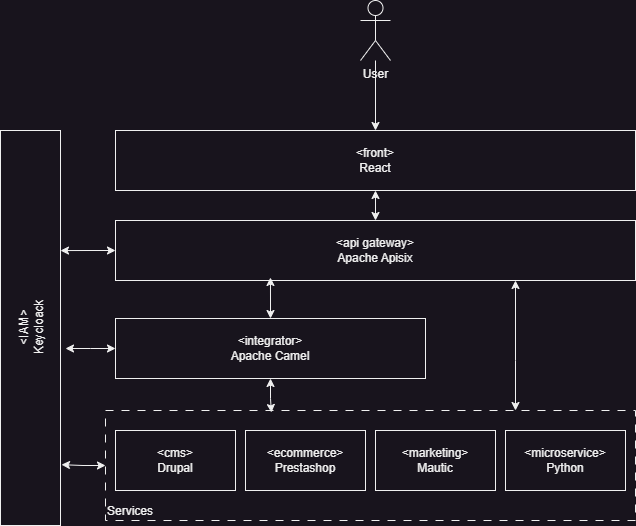

# Integration Stack

The purpose of this repository is build a stack, to test concepts of Enterprise Integration Patterns (EIP), to simplify the integration of various software systems.

This stack uses established enterprise-grade tools to support rapid development and seamless integration. The combination of Keycloak, Apache Camel, and APISIX ensures secure, efficient connectivity across the front-end and back-end services, accelerating the delivery and scalability of the platform.



1. **IAM (Identity and Access Management) - Keycloak**: Handles authentication and authorization for the entire stack, managing user identities across the system.

2. **Front-End - React**: The front-end layer where user interactions take place, built with React that integrate all components.

3. **API Gateway - Apache APISIX**: Acts as the gateway for API requests, handling routing, load balancing, is the one stop point to all conections.

4. **Integrator - Apache Camel**: Provides integration capabilities to link various services in the backend, EIP, transformation, and protocol adaptation.

5. **Services Layer**: the core systems integrated into the stack, each serving a distinct purpose:

   - **Drupal (CMS)**: A content management system used for managing and distributing content.
   - **PrestaShop (eCommerce)**: Manages online commerce, including product listings, checkout, and payments.
   - **Mautic (Marketing)**: Handles marketing automation, customer engagement, and campaigns.

   These services are an example for testing, but can be replaced with others

## Use cases

1. [One URL endpoint to connect all services](docs/01-onestop)

## Install

1. Copy .env.example file and rename to .env
2. Update variables of .env if is necessary
3. Generate certificates

```bash
# Certificate authority (CA)
openssl req -x509 -nodes -days 1024 -newkey rsa:2048 -new -sha256 -keyout assets/certs/localhost.ca.key -out assets/certs/localhost.ca.pem -subj "/C=EC/CN=localhost-CA"
openssl x509 -outform pem -in assets/certs/localhost.ca.pem -out assets/certs/localhost.ca.crt

# Localhost certificate
openssl req -new -nodes -newkey rsa:2048 -keyout assets/certs/localhost.key -out assets/certs/localhost.crt -subj "/C=EC/ST=Pichincha/L=Quito/O=Acme/CN=apisix_etcd"
openssl x509 -req -sha256 -days 1024 -in assets/certs/localhost.crt -CA assets/certs/localhost.ca.pem -CAkey assets/certs/localhost.ca.key -CAcreateserial -extfile assets/certs/domains.ext -out assets/certs/localhost.crt
```

4. Run

```bash
docker compose up
```

## Services

| **Service**                                                                                                                                                               | **URL**                                                                                                                                                                                                     | **Default users**                                   |
| ------------------------------------------------------------------------------------------------------------------------------------------------------------------------- | ----------------------------------------------------------------------------------------------------------------------------------------------------------------------------------------------------------- | --------------------------------------------------- |
| CMS Drupal: flexible, open-source CMS for complex, content-rich websites. Include demo data                                                                               | Front: [http://localhost:1080](https://localhost:1080) API: [http://localhost:1080/jsonapi](https://localhost:1080/jsonapi)                                                                                 | User: admin Password: admin                         |
| Ecommerce PrestaShop: open-source e-commerce platform. Include demo da                                                                                                    | Storefront:[https://localhost:2443](https://localhost:2443) Backoffice:[https://localhost:2443/backoffice](https://localhost:2443/backoffice) API: [https://localhost:2443/api](https://localhost:2443/api) | User: demo@prestashop.com Password: prestashop_demo |
| SMTP Mailpit: Email & SMTP testing tool with API for developers                                                                                                           | Backoffice:[http://localhost:8025](http://localhost:8025) SMTP host:mailpit port: 1025                                                                                                                      |                                                     |
| PostgreSQL: Powerful, open-source relational database, supports advanced data types.                                                                                      | Drupal port: 1432                                                                                                                                                                                           | Db, pwd, user: drupal                               |
| MariaDB: Open-source, MySQL-compatible relational database, fast, secure, scalable.                                                                                       | PrestaShop port: 2306                                                                                                                                                                                       | Db, pwd, user: prestashop                           |
| Apigateway Apisix: provides rich traffic management features like Load Balancing, Dynamic Upstream, Canary Release, Circuit Breaking, Authentication, Observability, etc. | Server: [http://localhost:3080](http://localhost:3080)                                                                                                                                                      |                                                     |
| Tracing monitor Zipkin: Check trace of routes in Apisix                                                                                                                   | Server: [http://localhost:9411](http://localhost:9411)                                                                                                                                                      |                                                     |
| IAM Keycloack: Manage authZ and authN                                                                                                                                     | Backoffice: [http://localhost:5080](http://localhost:5080)                                                                                                                                                  | User: admin Password: admin                         |

## Resources:

### Apache APISIX

- [Code samples](https://apisix.apache.org/docs/general/code-samples/)
- [Advanced URL rewriting with Apache Apisix](https://medium.com/apache-apisix/advanced-url-rewriting-with-apache-apisix-d34801a3a915)
- [Chaining API Requests with API Gateway](https://api7.ai/blog/chaining-api-requests-with-api-gateway)

### Apache Camel

- [Apache Camel con jbang](https://camel.apache.org/manual/camel-jbang.html)
- [EIP Enterprise Integrations Patterns](https://camel.apache.org/components/4.8.x/eips/enterprise-integration-patterns.html)
