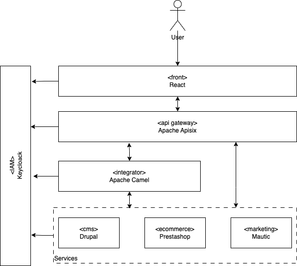

# Integration Stack

This repository contains components designed to test the following concepts:

- **Enterprise Integration Patterns** (EIP)
- **API Gateway** (Apache APISIX)
- **Identity and Access Management** (Keycloak)
- **Integration Tool** (Apache Camel)



## Install

1. Copy .env.example file and rename with .env
2. Update variables of .env
3. Create SSL certificate

```bash
openssl req -x509 -nodes -days 365 -newkey rsa:2048 -keyout localhost.key -out localhost.crt -subj "/C=US/ST=YourState/L=YourCity/O=YourOrganization/CN=localhost"
```

4. Run

```bash
docker compose up
```

## Services

| Service   | Description                                                                             | URL                                                                                                                                         | Default users                                       |
| --------- | --------------------------------------------------------------------------------------- | ------------------------------------------------------------------------------------------------------------------------------------------- | --------------------------------------------------- |
| CMS       | Drupal: flexible, open-source CMS for complex, content-rich websites. Include demo data | [http://localhost:1080](https://localhost:1080)                                                                                             | User: admin Password: admin                         |
| Ecommerce | PrestaShop: open-source e-commerce platform. Include demo data                          | Storefront:[http://localhost:2443](https://localhost:2443) Backoffice:[http://localhost:2443/backoffice](https://localhost:2443/backoffice) | User: demo@prestashop.com Password: prestashop_demo |
| Mailpit   | Mailpit - email & SMTP testing tool with API for developers                             | Backoffice:[http://localhost:8025](http://localhost:8025) SMTP port: 9025                                                                   |                                                     |
| Postgres  | PostgreSQL: powerful, open-source relational database, supports advanced data types.    | Drupal port: 1432                                                                                                                           | Db, pwd, user: drupal                               |
| Mariadb   | MariaDB: open-source, MySQL-compatible relational database, fast, secure, scalable.     | PrestaShop port: 2306                                                                                                                       | Db, pwd, user: prestashop                           |
