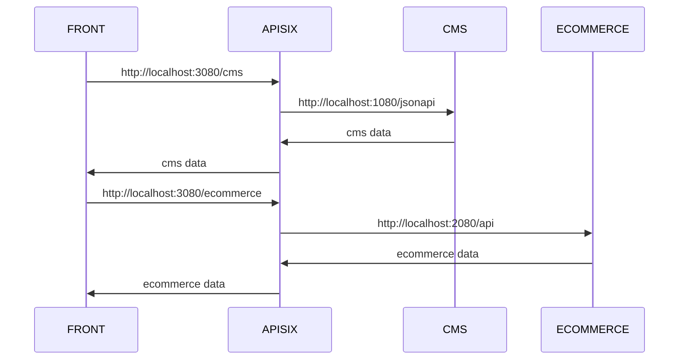

# One URL endpoint to connect all services

## Problem Statement

Why should the front develop the logic to connect to each service?

Teams often encounter challenges in managing service integrations effectively due to the distributed external and internal applications. The absence of a centralized point for service communication leads to:

1. **Increased Complexity**: Services must manage their own routing, security, and communication, resulting in redundancy and inefficiency.
2. **Fragmented Security**: Applying consistent authentication, authorization, and security policies across services is difficult, increasing the risk of vulnerabilities.
3. **Operational Overhead**: Monitoring, logging, and scaling individual services becomes resource-intensive.

## Proposed Solution

Implementing **Apache APISIX** as an API Gateway to integrate all services into a single URL endpoint addresses these challenges. APISIX will serve as the central point for service communication, offering the following advantages:

1. **Centralized Routing**: Simplifies communication by routing all service requests through a unified endpoint, making services accessible via a consistent URL structure.
2. **Enhanced Security**: Provides built-in support for security features such as JWT/OAuth authentication, rate limiting, and Web Application Firewall (WAF), ensuring robust protection across all services.
3. **High Performance and Scalability**: Leverages dynamic routing, load balancing, and caching mechanisms to optimize response times and ensure scalability.
4. **Interoperability**: Seamlessly integrates with backend services, ensuring smooth implementation.
5. **Operational Efficiency**: Enables centralized monitoring, logging, and analytics, streamlining debugging and performance optimization.
6. **Extensibility and Flexibility**: Supports plugins and custom scripts for handling evolving business needs without disrupting the underlying infrastructure.

## Implementation

Configure **Apache APISIX** to expose a endpoint that resolve which backend to connect



File: [services/apisix/apisix.yml](../services/apisix/apisix.yml)

```yml
upstreams:
  - id: "drupal"
    nodes:
      "drupal:80": 1
    type: "roundrobin"
    scheme: "http"
    pass_host: node
  - id: "prestashop"
    nodes:
      "prestashop:443": 1
    type: "roundrobin"
    scheme: "https"
    pass_host: node

routes:
  - name: "drupal_api"
    uri: "/cms/*"
    methods: ["GET", "POST", "PUT", "DELETE", "PATCH"]
    upstream_id: "drupal"
    plugins:
      proxy-rewrite:
        regex_uri:
          - "^/cms(/.*)?"
          - "/jsonapi$1"
      response-rewrite:
        # Control 404 errors in upstream
        vars:
          - ["status", "==", 404]
        body: '{"message": "Not Found"}'
        headers:
          Content-Type: "application/json"

  - name: "prestashop_api"
    uri: "/ecommerce"
    methods: ["GET", "POST", "PUT", "DELETE", "PATCH"]
    upstream_id: "prestashop"
    plugins:
      proxy-rewrite:
        uri: "/api"
      response-rewrite:
        headers:
          Content-Type: "$upstream_http_content_type"
```

### Test

1. Up the stack
2. To read CMS data go to [http://localhost:3080/cms/](http://localhost:3080/cms/)
3. To read Ecommerce data go to [http://localhost:3080/ecommerce/](http://localhost:3080/ecommerce/)
