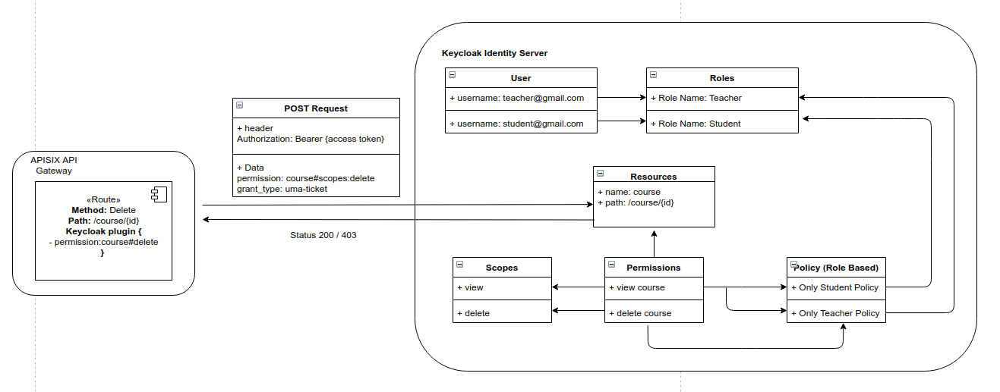
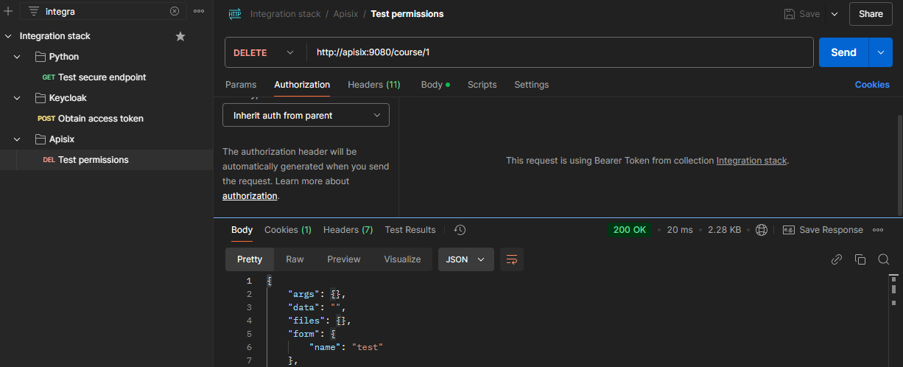

# Manage centralized authentication and authorization

## Problem Statement

## Proposed Solution

Use Keycloak IAM to manage all process of authn and authz

### Test

1. Up the stack
2. Configure Keycloak, import configuration files from [keycloak docs](keycloak), and create user for teacher and student
3. Setup postman, import [postman collection](postman/integration_stack.postman_collection.json)
3. In postman:
  - Configure collection variables as a teacher user
  - Obtain access token
  - Test permission
